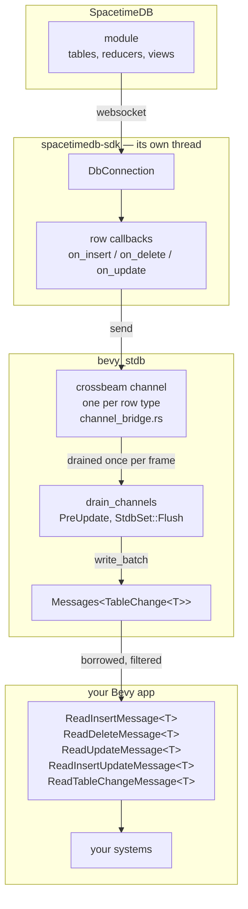
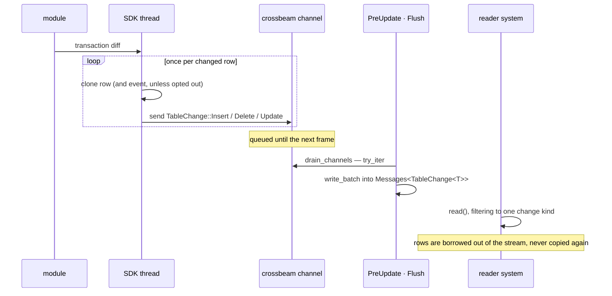
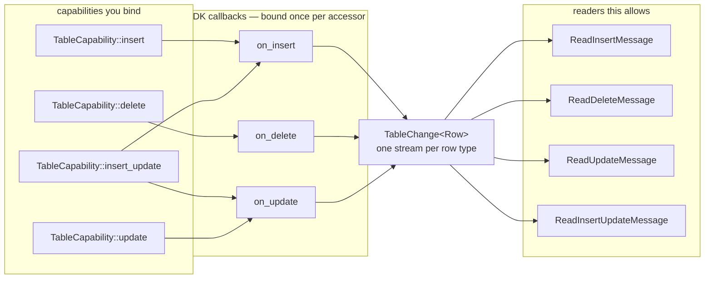
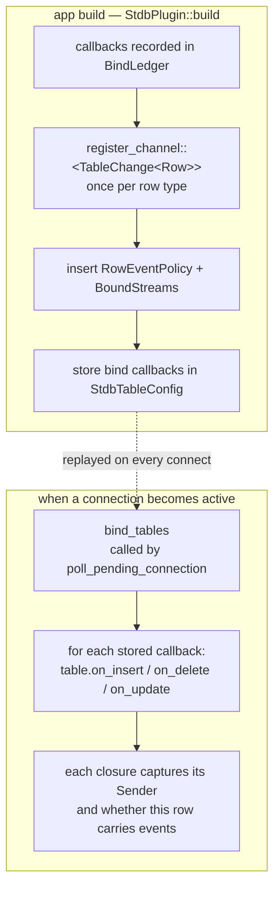
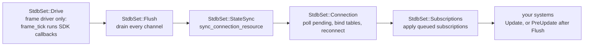
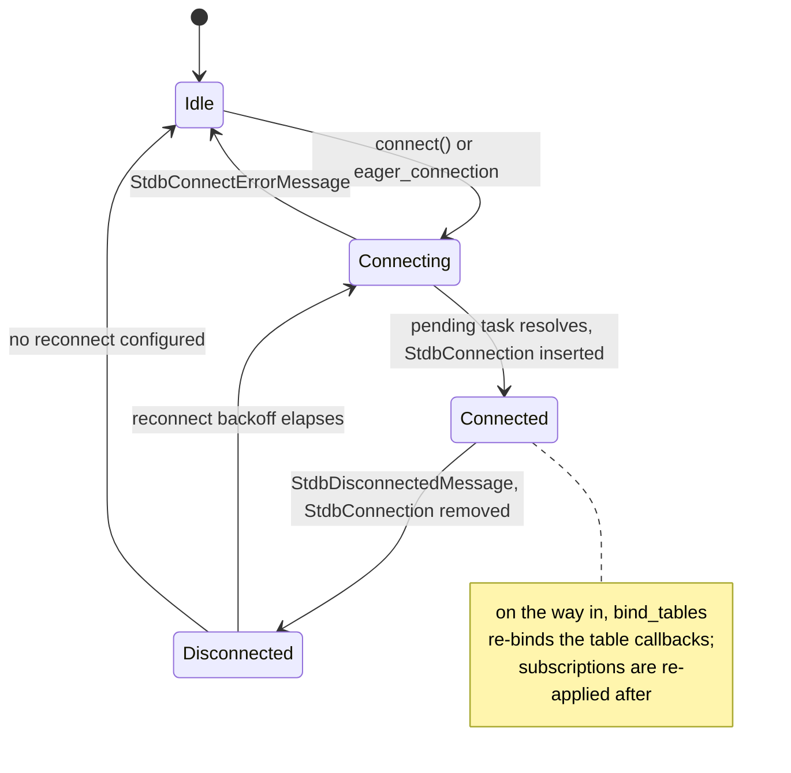
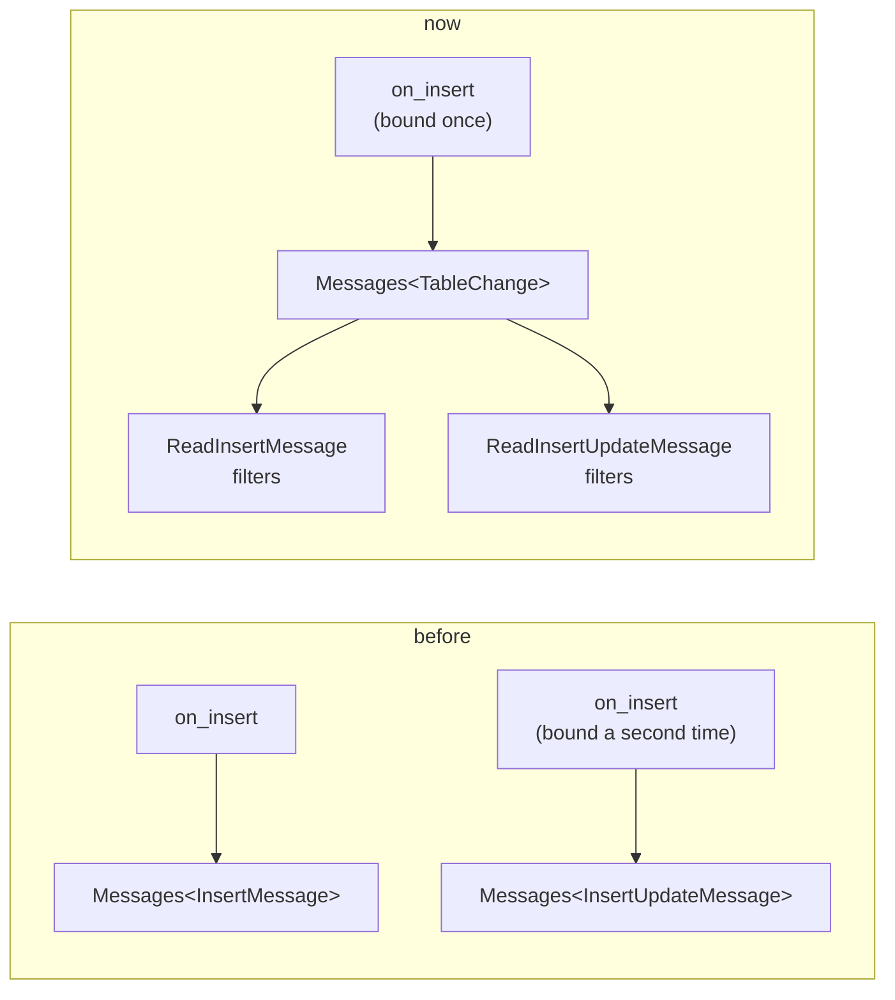

# Architecture

How `bevy_stdb` gets rows from a SpacetimeDB module into Bevy systems, and why it is shaped the
way it is. Every diagram here describes code in `src/`; the file and function names are real.

## Where the pieces live

SpacetimeDB's SDK is callback-driven and runs on its own thread. Bevy is a schedule that owns its
world and wants to be polled. The whole crate exists to bridge those two facts without either side
reaching into the other.

The channel is the thread boundary. Nothing above it touches the Bevy world, and nothing below it
touches the SDK.

## One row change, end to end

The SDK calls a row callback once per changed row, on its own thread, at whatever moment the
transaction arrives. Bevy reads it on the next frame.

Two consequences worth knowing:

- A change becomes visible at the **next `StdbSet::Flush`**, not the instant the SDK delivers it.
  Systems that must see it should run after that set.
- Order is preserved **within one row type**, because every change kind rides the same channel.
  Streams for different row types have no ordering relationship, and the SDK may group or coalesce
  rows while applying a transaction diff, so this is not an operation log.

## What a capability actually binds

A capability is not a stream. It decides which SDK callbacks get bound, and a reader is allowed
once the callbacks it needs are. There are three callbacks and nothing else: `insert_update` is
`insert` plus `update`, not a fourth thing. Binding is idempotent, so however many capabilities
need a callback it is bound once.

A reader checks for the callbacks it needs the first time it is read: `ReadInsertMessage` needs
`on_insert`, `ReadInsertUpdateMessage` needs `on_insert` and `on_update`, and so on.

`add_table` binds all three callbacks; `add_table_without_pk` and `add_view` bind insert and
delete; `add_event_table` binds insert only. Reading a view whose callback was never bound
panics naming it — because a filtered view of a stream nobody fed would otherwise read as a table
that simply never changes.

The stream is keyed by **row type**, not accessor. A table and a view over the same row share it,
and a change both of them see arrives twice with nothing to tell them apart.

## Registration happens once, binding happens per connection

These are two different phases, and conflating them is the usual source of confusion. Registration
is app-build time and cannot fail. Binding runs every time a connection becomes active — including
after a reconnect, against fresh SDK table handles.

Because the ledger deduplicates by accessor and callback, binding both a table and a view over one
row type registers two SDK callbacks but only one channel and one set of readers.

## Ordering inside PreUpdate

`StdbPlugin` chains five sets. Everything the crate does happens in `PreUpdate`, so by `Update` the
world is consistent.

`Drive` comes first because a frame-driven connection runs its SDK callbacks inside `frame_tick`:
ticking ahead of `Flush` means what they send is drained and readable in the same frame. A
background-driven connection sends from its own thread whenever it likes, and `Drive` is empty.

Tables are bound inside `poll_pending_connection`, at the moment a resolved connection is about to
become the `StdbConnection` resource and before its background driver starts. Nothing can deliver
a row to a connection whose callbacks are not yet bound.

Put your own table-reading systems in `Update`, or in `PreUpdate` with `.after(StdbSet::Flush)`.

## Connection lifecycle

Connecting is asynchronous: `StdbCommands::connect` queues a command that starts the attempt as an
`IoTaskPool` task, and a `PendingConnection` resource is polled each frame until it resolves. `StdbConnection` existing is
the signal that the connection is live — which is what re-binds the table callbacks.

Subscriptions are stored as intent in `StdbSubscriptions`, separately from the live connection, so
a reconnect re-applies them without the caller re-subscribing. Each `StdbConnection` carries a
generation number, and `StdbSubscriptions` remembers which generation its handles came from: when
the two differ, every intent is queued again. It deliberately does not wait for a disconnect
message. A frame-driven connection that `StdbCommands::reconnect` replaced is never ticked again,
so it never reports closing, and its successor would otherwise come up with no subscriptions.

### Telling a lost connection from a closed one

The SDK reports a server going away as `on_disconnect` with no error, which is also what it
reports when the client disconnects on purpose. So each connection shares an `AtomicBool` with its
own `on_disconnect` callback; `StdbConnection::disconnect` raises it, and the callback turns that
into `DisconnectIntent::Requested` or `DisconnectIntent::Lost`. Reconnect retries everything but
`Requested`, on a timer that counts `Time<Real>` so that pausing the game does not pause the
network.

## Why the readers are views

Earlier the crate projected each change into its own message type, one per bound capability. That
meant a row was copied once per stream that consumed it, and a system per stream ran every frame to
do the copying.

One callback, one copy, one buffer. The readers borrow out of it rather than receiving a copy, so
binding more of them costs nothing per change. The trade is that `TableChange<T>` is an enum sized
by its largest variant, so an app that binds exactly one capability stores a little more per change
than a purpose-built message would — see the Performance section of the README for what that costs.
